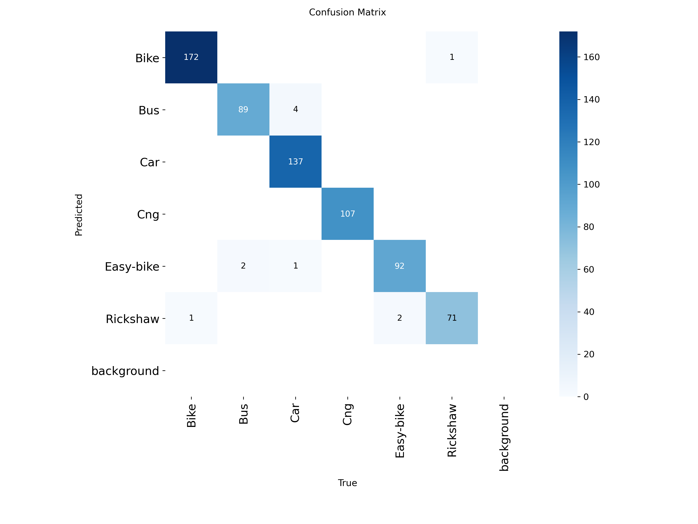
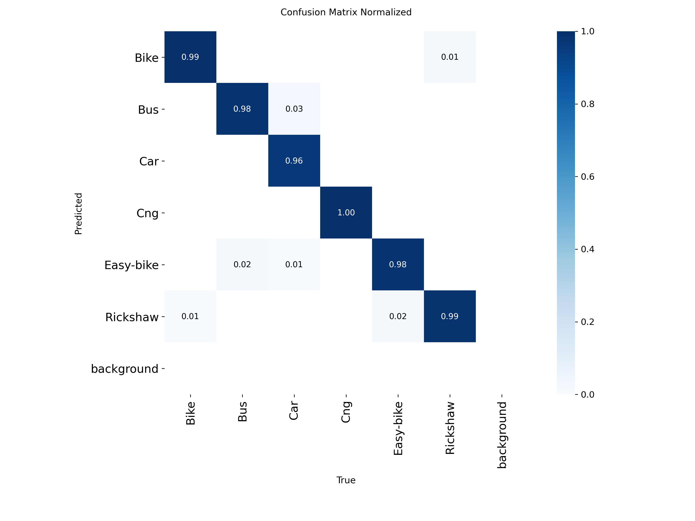
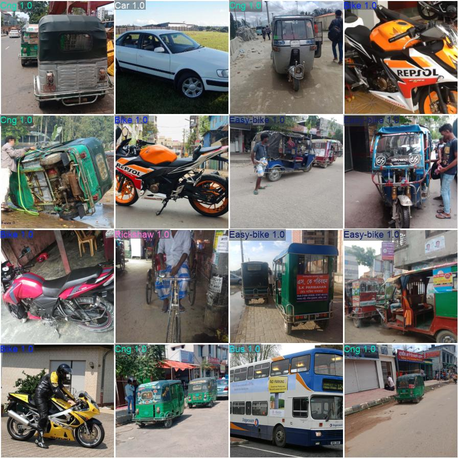
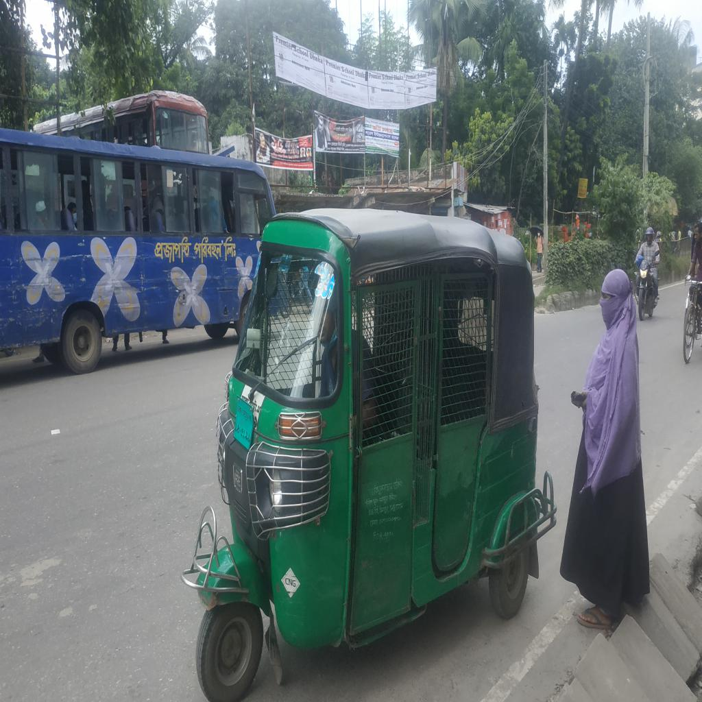

# 🚦 YOLOv8-Bangladeshi-Vehicle-Classifier


## Overview

YOLOv8-Bangladeshi-Vehicle-Classifier is a lightweight deep learning system developed for the classification of native Bangladeshi vehicles using transfer learning and the YOLOv8 Nano Classification architecture (YOLOv8n-cls).

The model was trained on the Poribohon-BD dataset and is capable of recognizing common vehicle categories found on Bangladeshi roads. The objective of this project is to explore efficient vehicle classification techniques suitable for intelligent transportation systems, traffic monitoring, and edge-device deployment.

---

## Vehicle Classes

The classifier recognizes six Bangladeshi vehicle categories:

* Bus
* Car
* Rickshaw
* Easy-bike (Auto Rickshaw)
* CNG
* Bike (Motorcycle)

---

## Dataset

**Dataset:** Poribohon-BD

The Poribohon-BD dataset contains images of native Bangladeshi vehicles collected under different environmental conditions, viewpoints, and lighting scenarios.

---

## Model Architecture

| Specification            | Value          |
| ------------------------ | -------------- |
| Model                    | YOLOv8n-cls    |
| Architecture Type        | Classification |
| Parameters               | 1,442,566      |
| Model Size               | ~3 MB          |
| Computational Complexity | 3.3 GFLOPs     |
| Input Resolution         | 224 × 224      |

---

## Performance Results

| Metric         | Score    |
| -------------- | -------- |
| Top-1 Accuracy | 98.38%   |
| Top-5 Accuracy | 100.00%  |
| Inference Time | 13.97 ms |
| Estimated FPS  | 71.6 FPS |

### Validation Confusion Matrix



### Normalized Confusion Matrix



### Validation Prediction Example



---

## Example Prediction

Input Image:



```text
test_image.jpg
```

Prediction:

```text
Class: CNG
Confidence: 100.00%
```

---

## Repository Structure

```text
YOLOv8-Bangladeshi-Vehicle-Classifier
│
├── assets/
│   ├── confusion_matrix.png
│   ├── confusion_matrix_normalized.png
│   ├── results.png
│   ├── test_image.jpg
│   └── val_batch0_pred.jpg
│
├── model/
│   └── best.pt
│
├── notebooks/
│   └── YOLOv8.ipynb
│
├── src/
│   └── inference.py
│
├── README.md
├── LICENSE
├── requirements.txt
└── .gitignore
```

---

## Installation

Clone the repository:

```bash
git clone https://github.com/YOUR_USERNAME/YOLOv8-Bangladeshi-Vehicle-Classifier.git
cd YOLOv8-Bangladeshi-Vehicle-Classifier
```

Install dependencies:

```bash
pip install -r requirements.txt
```

---

## Running Inference

```bash
python src/inference.py
```

The script loads the trained model (`best.pt`) and predicts the vehicle category of a user-provided image.

---

## Research Contribution

This project demonstrates the effectiveness of transfer learning with lightweight deep neural networks for Bangladeshi vehicle classification. The trained YOLOv8 Nano model achieves high classification accuracy while maintaining low computational requirements, making it suitable for deployment on resource-constrained devices.

---

## Future Improvements

* Increase the number of vehicle categories
* Evaluate larger YOLOv8 variants
* Deploy on edge devices such as Raspberry Pi and Jetson Nano
* Integrate real-time video stream classification
* Develop a complete intelligent traffic monitoring system

---

## Author

**Shouvon Deb**

Southeast University

Department of Computer Science and Engineering

Bangladesh

---

## License

This project is licensed under the MIT License.
