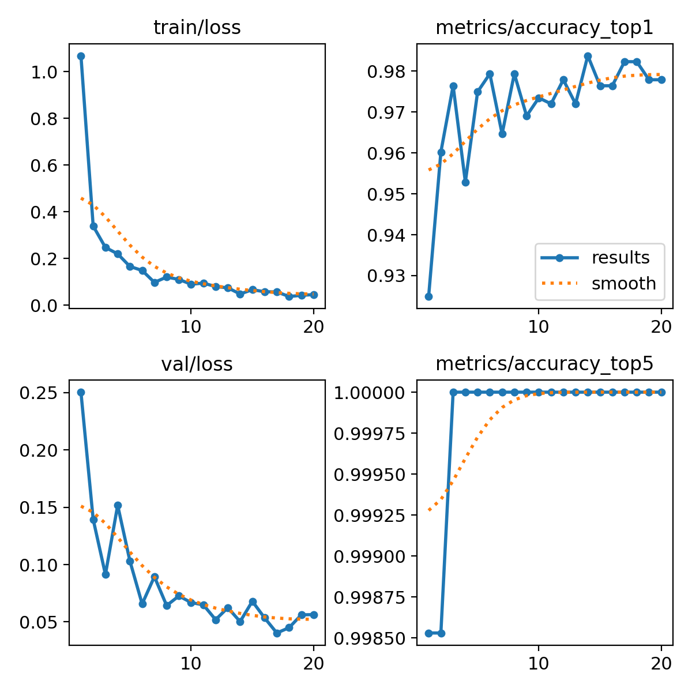

<div align="center">

# 🚦 YOLOv8 Bangladeshi Vehicle Classifier

### Transfer Learning Based Vehicle Classification for Bangladeshi Road Images


Lightweight deep learning model for classifying native Bangladeshi vehicles using **YOLOv8 Nano Classification (YOLOv8n-cls)** and **Transfer Learning**.

</div>

---

# 🌟 Project Overview

This project presents a lightweight vehicle classification system designed specifically for Bangladeshi road environments.

Using the **YOLOv8 Nano Classification architecture (YOLOv8n-cls)** and transfer learning, the model learns to distinguish between six common vehicle categories found in mixed urban traffic.

The system was trained using the **Poribohon-BD dataset** and achieved high classification accuracy while maintaining low computational requirements, making it suitable for real-time deployment and edge-device applications.

---

# 🚗 Supported Vehicle Classes

| Icon | Class                     |
| ---- | ------------------------- |
| 🚌   | Bus                       |
| 🚗   | Car                       |
| 🛺   | Rickshaw                  |
| 🚕   | CNG                       |
| 🏍️  | Bike                      |
| 🛺🇧🇩   | Easy-bike (Auto Rickshaw) |

---

# 📂 Dataset Information

### Dataset

**Poribohon-BD**

The dataset contains images of native Bangladeshi vehicles collected under:

* Different lighting conditions
* Different viewing angles
* Urban and highway environments
* Various weather conditions

This diversity helps improve model generalization and robustness.

---

# 🧠 Model Architecture

| Specification            | Value              |
| ------------------------ | ------------------ |
| Model                    | YOLOv8n-cls        |
| Architecture Type        | Classification     |
| Parameters               | 1,442,566          |
| Model Size               | ~3 MB              |
| Computational Complexity | 3.3 GFLOPs         |
| Input Resolution         | 224 × 224          |
| Framework                | Ultralytics YOLOv8 |

---

# ⚡ Inference Performance

### Validation Speed

| Process        | Time     |
| -------------- | -------- |
| Preprocessing  | 0.00 ms  |
| Inference      | 13.97 ms |
| Postprocessing | 0.00 ms  |
| Total Latency  | 13.97 ms |

### Real-Time Capability

| Metric        | Value    |
| ------------- | -------- |
| Estimated FPS | 71.6 FPS |

---

# 📊 Performance Results

| Metric            | Score        |
| ----------------- | ------------ |
| 🎯 Top-1 Accuracy | 98.38%       |
| 🎯 Top-5 Accuracy | 100.00%      |
| ⚡ Inference Time  | 13.97 ms     |
| 🚀 Estimated FPS  | 71.6 FPS     |
| 🧠 Parameters     | 1.44 Million |
| 📦 GFLOPs         | 3.3          |

---

# 📈 Training Results

### Training Curves



### Confusion Matrix


### Normalized Confusion Matrix


---

# 🔍 Sample Prediction

### Validation Prediction


---

# 🖼️ Example Inference

### Input Image


### Model Output

```text
Prediction: CNG
Confidence: 100.00%
```

Example console output:

```text
image 1/1 test_image.jpg

CNG 1.00
Bus 0.00
Easy-bike 0.00
Bike 0.00
Rickshaw 0.00

Prediction:
This is a CNG (100.00% confidence)
```

---

# 🏗️ Repository Structure

```text
YOLOv8-Bangladeshi-Vehicle-Classifier
│
├── assets/
│   ├── confusion_matrix.png
│   ├── confusion_matrix_normalized.png
│   ├── results.png
│   ├── test_image.jpg
│   └── val_batch0_pred.jpg
│
├── model/
│   └── best.pt
│
├── notebooks/
│   └── YOLOv8.ipynb
│
├── src/
│   └── inference.py
│
├── README.md
├── LICENSE
├── requirements.txt
└── .gitignore
```

---

# 🚀 Installation

### Clone Repository

```bash
git clone https://github.com/YOUR_USERNAME/YOLOv8-Bangladeshi-Vehicle-Classifier.git
cd YOLOv8-Bangladeshi-Vehicle-Classifier
```

### Install Dependencies

```bash
pip install -r requirements.txt
```

---

# ▶️ Running Inference

```bash
python src/inference.py
```

The script loads the trained model (`best.pt`) and predicts the class of a user-provided image.

---

# 🔬 Research Contribution

This work demonstrates the effectiveness of transfer learning combined with a lightweight YOLOv8 Nano architecture for Bangladeshi vehicle classification.

The model achieves:

* High classification accuracy
* Fast inference speed
* Low computational complexity
* Suitability for real-time deployment

Potential application areas include:

* Intelligent Transportation Systems (ITS)
* Traffic Monitoring
* Smart City Infrastructure
* Edge AI Applications
* Vehicle Analytics

---

# 🚀 Future Improvements

* Increase the number of vehicle categories
* Train on larger Bangladeshi traffic datasets
* Evaluate YOLOv8s, YOLOv8m and YOLOv8l variants
* Deploy on Raspberry Pi and NVIDIA Jetson Nano
* Support video stream classification
* Integrate object detection and vehicle counting

---

# 👨‍💻 Author

### Shouvon Deb

Southeast University

Department of Computer Science and Engineering

Bangladesh 🇧🇩

Research Project

---

# 📄 License

This project is licensed under the MIT License.
